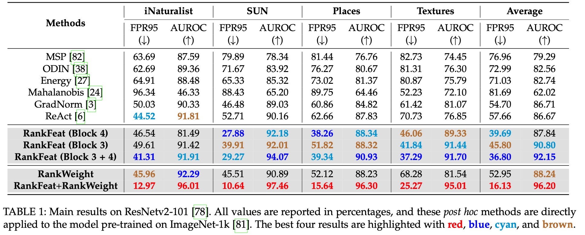
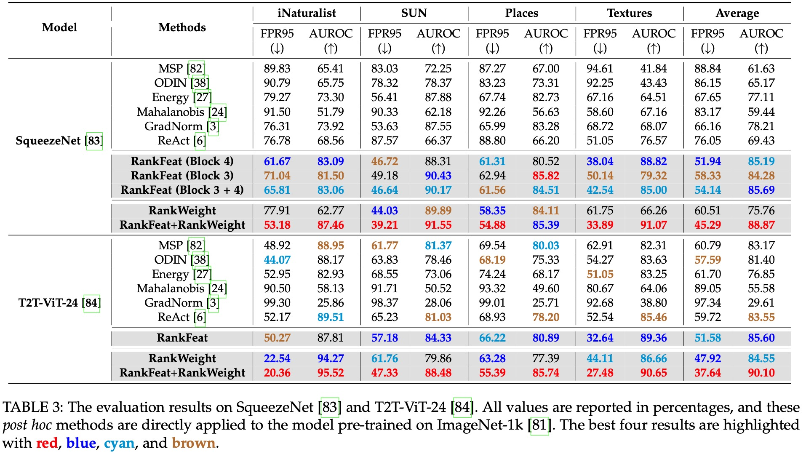
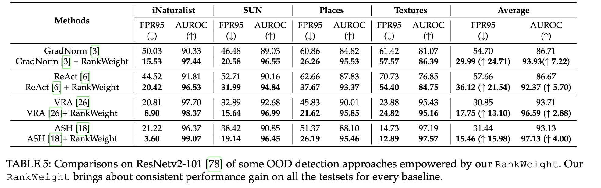
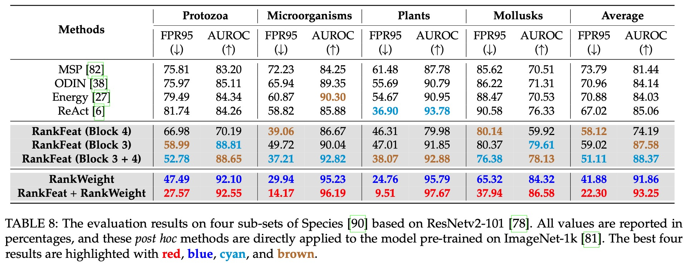

# RankFeat
NeurIPS22 paper "[RankFeat: Rank-1 Feature Removal for Out-of-distribution Detection](https://arxiv.org/abs/2209.08590)"

Expanded journal version "[RankFeat&RankWeight: Rank-1 Feature/Weight Removal for Out-of-distribution Detection](https://arxiv.org/abs/)"

## ID/OOD Dataset Preparation

**In-Distribution (ID) dataset.** Please download [ImageNet-1k](http://www.image-net.org/challenges/LSVRC/2012/index) and use its validation set as the ID set. 

**Out-of-Distribution (OOD) dataset.** For the used OOD datasets (iNaturalist, SUN, Places, and Textures), please download them from the following links:

```bash
wget http://pages.cs.wisc.edu/~huangrui/imagenet_ood_dataset/iNaturalist.tar.gz
wget http://pages.cs.wisc.edu/~huangrui/imagenet_ood_dataset/SUN.tar.gz
wget http://pages.cs.wisc.edu/~huangrui/imagenet_ood_dataset/Places.tar.gz
wget https://www.robots.ox.ac.uk/~vgg/data/dtd/download/dtd-r1.0.1.tar.gz
```

For the large-scale [Species](https://arxiv.org/pdf/1911.11132.pdf) dataset, please download the four subsets (Protozoa, Microorganisms, Plants, and Mollusks) from the [official link](https://drive.google.com/drive/folders/1j6l7jfGbKL5P5acwKVyktn4y8bWSTeAJ?usp=sharing).

## Pre-trained Model Preparation

For SqueezeNet, it is already available in the Pytorch library. For BiT-S ResNetv2-101 and T2T-ViT-24, one can download the BiT-S ResNetv2-101 and T2T-ViT by the following links:

```bash
wget http://pages.cs.wisc.edu/~huangrui/finetuned_model/BiT-S-R101x1-flat-finetune.pth.tar
wget https://github.com/yitu-opensource/T2T-ViT/releases/download/main/82.6_T2T_ViTt_24.pth.tar
```

For more BiT pre-trained models, one can also refer to [BiT-S pre-trained families](https://github.com/google-research/big_transfer).

## Usage

Check [train_resnetv2.sh](https://github.com/KingJamesSong/RankFeat/blob/main/scripts/test_resnetv2.sh), [train_squeezenet.sh](https://github.com/KingJamesSong/RankFeat/blob/main/scripts/test_squeezenet.sh), and [train_t2tvit.sh](https://github.com/KingJamesSong/RankFeat/blob/main/scripts/test_t2tvit.sh) in the scripts folder for the specific usages on each architecture.

Besides our proposed RankFeat, the previous *post hoc* methods are also implemented here, including [MSP](https://arxiv.org/pdf/1610.02136.pdf), [ODIN](https://arxiv.org/pdf/1706.02690.pdf), [Energy](https://proceedings.neurips.cc/paper/2020/file/f5496252609c43eb8a3d147ab9b9c006-Paper.pdf), [Mahalanobis](https://proceedings.neurips.cc/paper/2018/file/abdeb6f575ac5c6676b747bca8d09cc2-Paper.pdf), [GradNorm](https://proceedings.neurips.cc/paper/2021/file/063e26c670d07bb7c4d30e6fc69fe056-Paper.pdf), and [ReAct](https://proceedings.neurips.cc/paper/2021/file/01894d6f048493d2cacde3c579c315a3-Paper.pdf). 

## OOD Evaluation Results

<div align=center></div>
<div align=center></div>
<div align=center></div>
<div align=center></div>


## Citation

If you think the code is helpful to your research, please consider citing our paper:

```
@inproceedings{song2022rankfeat,
  title={RankFeat: Rank-1 Feature Removal for Out-of-distribution Detection},
  author={Song, Yue and Sebe, Nicu and Wang, Wei},
  booktitle={NeurIPS},
  year={2022}
}
@inproceedings{song2023rankfeat,
  title={RankFeat&RankWeight: Rank-1 Feature/Weight Removal for Out-of-distribution Detection},
  author={Song, Yue and Sebe, Nicu and Wang, Wei},
  booktitle={Arxiv},
  year={2023}
}
```

The code is built based on [MOS](https://github.com/deeplearning-wisc/large_scale_ood) and [GradNorm](https://github.com/deeplearning-wisc/gradnorm_ood). If you have any questions or suggestions, please feel free to contact me via `yue.song@unitn.it`.

